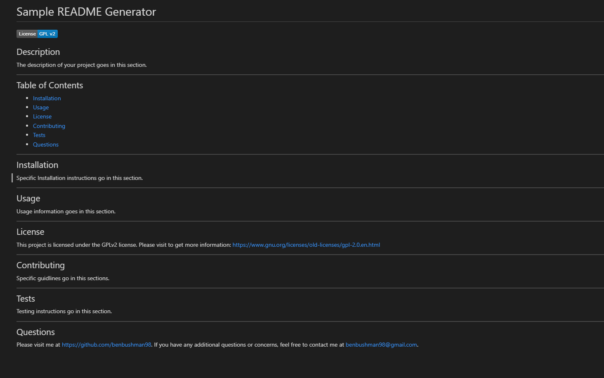

# README Generator

## Description
This project was developed with node.js. When you need a professional README, come here! When you run node index.js in the command line, you are presented with prompts to help you generate a README file. You will be able to choose a title, write a description, share installation instructions, show usage information, choose licesing info, give details on how to contribute to your project, describe testing instructions, and add your github profile and email address for additional questions. For additional information on how to use this project, use the video walktrough link at the below.

## Walkthrough Video Link
https://drive.google.com/file/d/1ec4i3cMlf0eGpK1hSPkQLQKKQUvR77DX/view?usp=sharing

## Screenshot of a generated README

